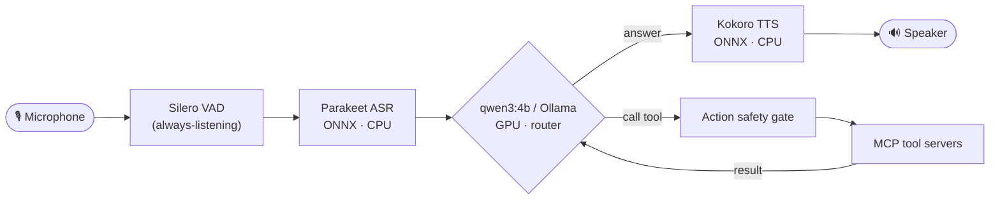
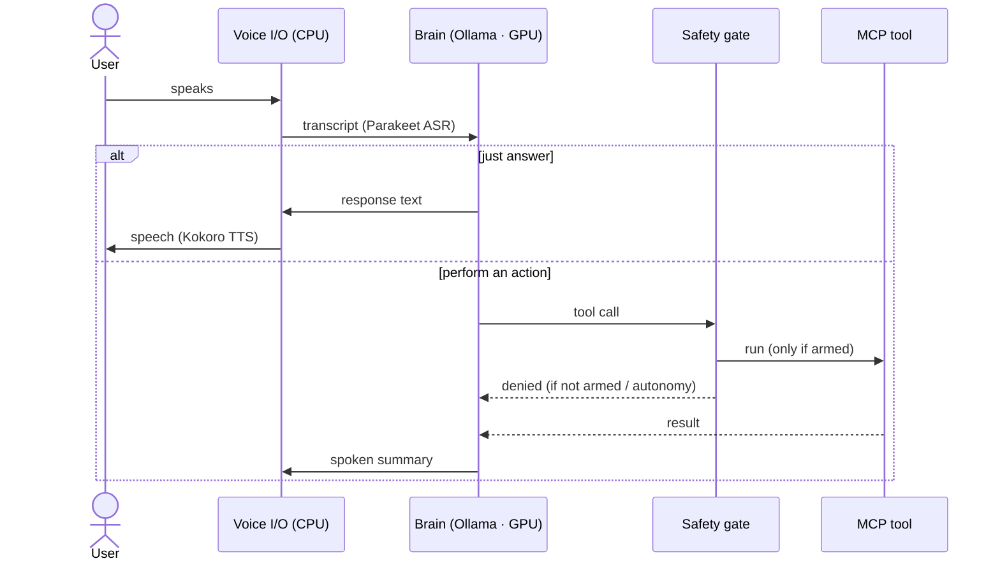
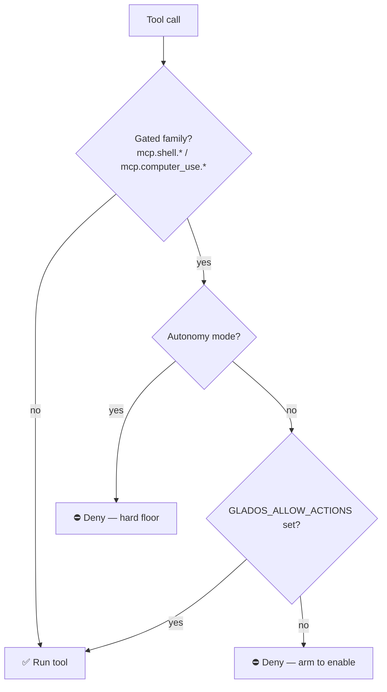

# AI Linux Assistant

A **local-first, Wayland-native voice assistant** for Linux that you can *talk to* — and that can *act* on
your machine (open apps, run commands, answer questions) through a confirmed, safety-gated tool layer.

Everything in the runtime path runs **locally and open-source**. No cloud, no API keys required.
Tuned to fit a **6 GB GPU** (RTX 3060 Mobile) by keeping the LLM on the GPU and speech on the CPU.

> Built by vendoring & evolving the excellent [dnhkng/GLaDOS](https://github.com/dnhkng/GLaDOS) engine.
> Design notes & decisions: [PLAN.md](PLAN.md) · Contributor/agent guide: [CLAUDE.md](CLAUDE.md).

---

## ✨ Features
- **Always-listening voice loop** with VAD and **barge-in** (interrupt while it speaks).
- **Voice *and* text** input (`input_mode: both`).
- **Local brain** — `qwen3:4b` via [Ollama](https://ollama.com) (GPU); `llama3.2` (3B) as a lighter fallback.
- **CPU speech** — Parakeet ASR + Kokoro TTS (ONNX) so the GPU stays free for the LLM.
- **Acts on your desktop** — Wayland control (AT-SPI / portals / ydotool) + a shell executor, as MCP tools.
- **Safety gate** — irreversible actions are denied unless you explicitly arm them.
- **Skills** — small procedure library the model can retrieve at runtime.

---

## 🧠 Architecture



The brain (LLM) is the only component on the GPU; ASR, VAD, and TTS run on the CPU as ONNX — that split
is what makes the assistant fit in 6 GB of VRAM.

### A conversational turn



---

## 🚀 Quick start

```bash
# 1. Brain: install Ollama, then pull the model
ollama serve &        # if not already running
ollama pull qwen3:4b      # default brain (or `ollama pull llama3.2` — lighter 3B fallback)

# 2. Python env (conda; Python 3.12)
conda create -n AI_Linux python=3.12 -y
conda install -n AI_Linux -c conda-forge portaudio -y
conda run -n AI_Linux pip install -e ".[cpu]"

# 3. (optional) Desktop control — build the Rust MCP server and install it
#    git clone https://github.com/agent-sh/computer-use-linux && (cd computer-use-linux && cargo build --release)
#    cp computer-use-linux/target/release/computer-use-linux ~/.local/bin/
#    computer-use-linux doctor      # check AT-SPI / portals / ydotool

# 4. Run
./run.sh                 # voice + text
./run.sh tui             # text UI (Textual)
./run.sh download        # pre-fetch ONNX model weights
./run.sh --allow-actions # arm shell/desktop actions for this session
```

The first run downloads the ONNX speech models (Parakeet / Kokoro / Silero VAD) automatically.

---

## 🔧 Configuration

All settings live in [`configs/ai_linux_config.yaml`](configs/ai_linux_config.yaml) (top key `Glados:`):

| Setting | What it does |
|---|---|
| `llm_model` / `completion_url` | brain model + endpoint (default local Ollama `qwen3:4b`) |
| `voice` | Kokoro TTS voice (e.g. `af_bella`) |
| `asr_engine` | `ctc` (faster) or `tdt` (more accurate) — both CPU |
| `input_mode` | `audio`, `text`, or `both` |
| `interruptible` | barge-in (interrupt the assistant by speaking) |
| `wake_word` | a trigger phrase, or `null` for always-listening |
| `personality_preprompt` | system prompt / persona |
| `mcp_servers` | the tools the assistant can call |

### Local or Groq brain

Two interchangeable brains — **speech, tools, and the safety gate are identical; only the LLM differs**:

| Brain | Config | Run | Notes |
|---|---|---|---|
| **Local** (default) | `configs/ai_linux_config.yaml` | `./run.sh` | `qwen3:4b` via Ollama (GPU); `llama3.2` 3B = lighter fallback |
| **Groq API** | `configs/ai_linux_groq.yaml` | `export GROQ_API_KEY=… && ./run.sh --groq` | faster/stronger cloud model; key read from env, never stored |

Any other OpenAI-compatible endpoint works too — point `completion_url`/`api_key` at it. **Local stays the
default focus.**

---

## 🛠 Tools (MCP servers)

Tools are exposed to the model as `mcp.<server>.<tool>`.

| Server | Tools | Purpose | Gated |
|---|---|---|:---:|
| `system_info` | `cpu_load`, `memory_usage`, `temperatures`, … | system stats | — |
| `time_info` | `now_iso`, `uptime_seconds`, … | time / uptime | — |
| `memory` | — | conversation memory | — |
| `skills` | `list_skills`, `find_skill` | retrieve a procedure | — |
| **`shell`** | `run_command` | run a local command | ✅ |
| **`computer_use`** | click / type / window / screenshot … | Wayland desktop control | ✅ |

### Safety gate

Gated tools (shell + desktop control) are **off by default** and fail safe:



Arm actions with `./run.sh --allow-actions` (or `export GLADOS_ALLOW_ACTIONS=1`). The autonomous loop can
**never** run gated actions, regardless of settings.

---

## 📁 Project layout

```
configs/ai_linux_config.yaml   # active config
run.sh                         # launcher
skills/                        # SKILL-*.md procedures (served by mcp.skills)
src/glados/                    # vendored GLaDOS engine (core/ mcp/ ASR/ TTS/ audio_io/ …)
models/                        # model configs (weights download at runtime)
PLAN.md  CLAUDE.md  TOP10.md   # plan · agent guide · research
```

---

## 📌 Status
v1 is built and committed; it has been verified at the import/config/unit level but **not yet run
end-to-end** — that first live run is the remaining step. See [PLAN.md](PLAN.md) for the full roadmap
(delegated executor, richer memory/RAG, per-action voice confirmation).

## 🙏 Credits & licenses
- Engine: **[dnhkng/GLaDOS](https://github.com/dnhkng/GLaDOS)** (MIT) — vendored; see [`LICENSE.GLaDOS`](LICENSE.GLaDOS).
- Desktop control: **[agent-sh/computer-use-linux](https://github.com/agent-sh/computer-use-linux)** (MIT).
- Speech: Parakeet (ASR), Kokoro (TTS), Silero (VAD). Brain: Ollama + Qwen3 / Llama 3.2 (local) or [Groq](https://groq.com) (API).
- Pattern references: Newelle, RealtimeVoiceChat, Fabric, AIChat.

Vendored components retain their original licenses.
