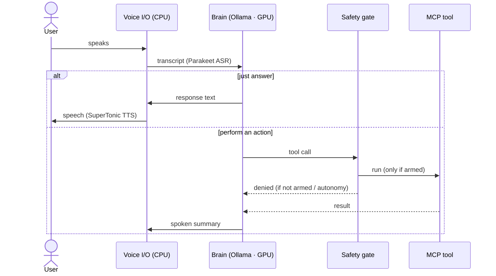
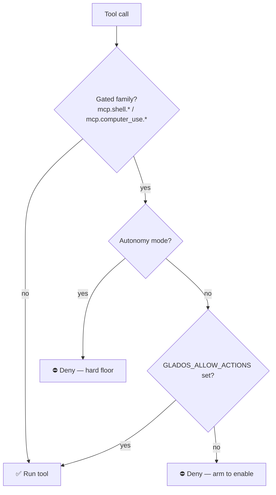

# AI Linux Assistant

A **local-first, Wayland-native voice assistant** for Linux that you can *talk to* — and that can *act* on
your machine (open apps, run commands, answer questions) through a confirmed, safety-gated tool layer.

Everything in the runtime path runs **locally and open-source**. No cloud, no API keys required.
Tuned to fit a **6 GB GPU** (RTX 3060 Mobile) by keeping the LLM on the GPU and speech on the CPU.

> Built by vendoring & evolving the excellent [dnhkng/GLaDOS](https://github.com/dnhkng/GLaDOS) engine.
> Design notes & decisions: [PLAN.md](PLAN.md). (An agent-onboarding `CLAUDE.md` is kept locally.)

---

## ✨ Features
- **Wake-word voice loop** with VAD (say "computer …"; half-duplex by default — see [Barge-in](#-barge-in-interrupting-the-assistant) for full-duplex).
- **Voice *and* text** input (`input_mode: both`).
- **Local brain** — `qwen3:4b` via [Ollama](https://ollama.com) (GPU); `llama3.2` (3B) as a lighter fallback.
- **CPU speech** — Parakeet ASR + SuperTonic TTS (Kokoro fallback), all ONNX, so the GPU stays free for the LLM.
- **Acts on your desktop** — Wayland control (AT-SPI / portals / ydotool) + a shell executor, as MCP tools.
- **Safety gate** — irreversible actions are denied unless you explicitly arm them.
- **Skills** — small procedure library the model can retrieve at runtime.
- **On-screen overlay** (GNOME Shell extension) — top-right orb + transcript that tracks state, with
  listening-mode controls (always / wake / click) that can hand the mic back to other apps.

---

## 🧠 Architecture


The brain (LLM) is the only component on the GPU; ASR, VAD, and TTS run on the CPU as ONNX — that split
is what makes the assistant fit in 6 GB of VRAM.

### A conversational turn



---

## 🚀 Quick start

One script does everything — install and run:

```bash
./ai-linux setup     # one-time: conda env, deps, Ollama + qwen3:4b, ONNX weights, GNOME launcher + icon
./ai-linux           # voice + text  (auto-starts Ollama; on a fresh machine it self-runs setup first)
```

Then, day to day:

```bash
./ai-linux           # voice + text, local qwen3:4b brain      [default]
./ai-linux tui       # text-only Textual UI
./ai-linux doctor    # check everything is ready
./ai-linux download  # (re)fetch the ONNX speech weights
./ai-linux say "hi"  # speak a phrase and exit
# flags: --groq (cloud brain)   --local (default)   --no-actions (don't arm shell/desktop actions)
#        --barge-in (interrupt by voice; use headphones)   --overlay-mode always|wake|click
```

Or click **AI Linux Assistant** in the GNOME app grid (installed by `setup`, with a custom glass-orb icon).
`setup` is idempotent — safe to re-run. Speech weights download on first `setup` only if not already present.

---

## 🔧 Configuration

All settings live in [`configs/ai_linux_config.yaml`](configs/ai_linux_config.yaml) (top key `Glados:`):

| Setting | What it does |
|---|---|
| `llm_model` / `completion_url` | brain model + endpoint (default local Ollama `qwen3:4b`) |
| `voice` | TTS voice: `supertonic:M1` (default; male `M1`/`M3`–`M5`, female `F1`–`F5`) or a Kokoro voice e.g. `am_michael` |
| `asr_engine` | `ctc` (faster) or `tdt` (more accurate) — both CPU |
| `input_mode` | `audio`, `text`, or `both` |
| `interruptible` | barge-in (interrupt the assistant by speaking) |
| `wake_word` | a trigger phrase, or `null` for always-listening |
| `personality_preprompt` | system prompt / persona |
| `mcp_servers` | the tools the assistant can call |

### Local or Groq brain

Two interchangeable brains — **speech, tools, and the safety gate are identical; only the LLM differs**:

| Brain | Config | Run | Notes |
|---|---|---|---|
| **Local** (default) | `configs/ai_linux_config.yaml` | `./ai-linux` | `qwen3:4b` via Ollama (GPU); `llama3.2` 3B = lighter fallback |
| **Groq API** | `configs/ai_linux_groq.yaml` | `export GROQ_API_KEY=… && ./ai-linux --groq` | faster/stronger cloud model; key read from env, never stored |

Any other OpenAI-compatible endpoint works too — point `completion_url`/`api_key` at it. **Local stays the
default focus.**

---

## 🛠 Tools (MCP servers)

Tools are exposed to the model as `mcp.<server>.<tool>`.

| Server | Tools | Purpose | Gated |
|---|---|---|:---:|
| `system_info` | `cpu_load`, `memory_usage`, `temperatures`, … | system stats | — |
| `time_info` | `now_iso`, `uptime_seconds`, … | time / uptime | — |
| `memory` | — | conversation memory | — |
| `skills` | `list_skills`, `find_skill` | retrieve a procedure (the relevant command is also auto-injected per turn) | — |
| `skills_writer` | `save_skill` | learn a new skill — writes a markdown draft only, never runs anything | — |
| `voice` | `list_voices`, `set_voice` | change the assistant's own TTS voice live | — |
| **`shell`** | `run_command` | run a local command (as you, never sudo) | ✅ |
| **`computer_use`** | click / type / window / screenshot … | Wayland desktop control | ✅ |

### Safety gate

Gated tools (shell + desktop control) are **off by default** and fail safe:



Interactive launches (`./ai-linux`, the GNOME app icon, `./ai-linux tui`) **arm actions by default** so the
assistant can actually act — mute the device, open apps, run commands. Disable with `./ai-linux --no-actions`.
The autonomous loop can **never** run gated actions, regardless of settings (hard floor).

### No superuser

The **running assistant never uses `sudo`/root** — every command runs as your user (verified: there is no
`sudo` call anywhere in the runtime). The **only** place sudo is used is `./ai-linux setup`, which does a
one-time `apt` install of a few user-level desktop tools (`brightnessctl`, `playerctl`, `gnome-screenshot`,
`wl-clipboard`) so brightness / screenshots / media / clipboard work — skipped automatically if they're
already present. If a tool somehow isn't installed, that skill tells you to run `./ai-linux setup` instead
of failing silently. Setup also scopes `ydotool`'s input access via a **udev rule** (per-session ACL on
`/dev/uinput`), not the broad `input` group, so nothing gains system-wide keystroke read.

A destructive-command **denylist** (`mcp/shell_server.py`) refuses clearly catastrophic commands
(`rm -rf ~`, `dd of=/dev/…`, `mkfs`, fork bomb, `curl … | sh`, …) regardless of how they were produced.
See **[SECURITY.md](SECURITY.md)** for the full threat model, guarantees, and how to run disarmed
(`./ai-linux --no-actions`).

---

## 🗣 Barge-in (interrupting the assistant)

By default the loop is **half-duplex**: while the assistant speaks, the mic is ignored, because the
capture path (conda PortAudio → raw ALSA on the USB device) has **no acoustic echo cancellation**, so an
open mic would transcribe the assistant's own TTS coming back through the speakers.

`./ai-linux --barge-in` flips this to **full-duplex** (`interruptible: true`) — your voice cuts the
assistant off mid-sentence (GLaDOS cancels TTS the instant VAD fires). **Use headphones or a headset** so
the mic can't hear the speaker. This is exactly how LightSpeak stays echo-free — its audio reaches the agent
as a clean, already-AEC'd client stream; locally, headphones give the same clean input.

**Hands-free over open speakers** needs real echo cancellation in the capture path. Two facts make this a
deliberate, separate step on this machine (both verified):
- conda's PortAudio only enumerates raw `hw:` cards — it cannot open PipeWire's `pipewire`/`pulse` PCMs, so
  it can't be routed through PipeWire's built-in `module-echo-cancel` (WebRTC AEC).
- the in-process AEC bindings (`speexdsp`, `webrtc-audio-processing`) need system `-dev` headers
  (`sudo apt install libspeexdsp-dev`) before their wheels will build.

So in-process AEC (capture raw, cancel the TTS echo in Python before VAD, using the played audio as the
reference) is the route to speaker barge-in — it's scoped but needs that one `sudo` install plus on-hardware
tuning. Ask and it can be wired behind `--barge-in` with a clean fall back to headphone/half-duplex mode.

---

## 🪟 On-screen overlay (optional)

A GNOME Shell extension shows a top-right **orb + transcript** that tracks the assistant's state
(idle / listening / thinking / speaking), with a mode header:

| Mode | Behavior | Sound card |
|---|---|---|
| **Always** | continuous listening | held by the assistant |
| **Wake** | acts only on a keyword (default "computer") | held (to hear the keyword) |
| **Click** | click the orb to talk one turn | **released between turns → other apps can use it** |
| **Mute** | instant pause | **released** |

`./ai-linux setup` installs and enables it; **log out and back in once** so GNOME loads it (Wayland only
loads new extensions at login). The orb is drawn natively by the Shell (not the browser Rive demo). Run
without it via `./ai-linux --no-overlay`, or pick the starting mode with `--overlay-mode=click`.

## 📁 Project layout

```
ai-linux                       # single launcher + installer (setup · doctor · run)
configs/ai_linux_config.yaml   # active config  (+ ai_linux_groq.yaml for the Groq brain)
skills/                        # SKILL-*.md procedures (served by mcp.skills)
ui/                            # persona.html demo, icon/, gnome-extension/ (on-screen overlay)
src/glados/                    # vendored GLaDOS engine (core/ mcp/ overlay/ ASR/ TTS/ audio_io/ …)
models/                        # model configs + ONNX speech weights (weights gitignored)
data/                          # ASR warm-up sample + demo assets
PLAN.md                        # design notes & decisions  (CLAUDE.md = local agent guide)
```

---

## 📌 Status
v1 is built, committed, and verified hands-on (configs load; safety gate incl. the autonomy hard-floor; all
MCP servers; launcher + CLI wiring). The runtime is fully provisioned locally — Ollama + `qwen3:4b` and all
ONNX speech weights are already in place — so **the one remaining step is the first live voice run** (mic +
GPU). See [PLAN.md](PLAN.md) for the roadmap (delegated executor, richer memory/RAG, per-action voice confirmation).

## 🙏 Credits & licenses
- Engine: **[dnhkng/GLaDOS](https://github.com/dnhkng/GLaDOS)** (MIT) — vendored; see [`LICENSE.GLaDOS`](LICENSE.GLaDOS).
- Desktop control: **[agent-sh/computer-use-linux](https://github.com/agent-sh/computer-use-linux)** (MIT).
- Default TTS: **[supertone-inc/supertonic](https://github.com/supertone-inc/supertonic)** (code MIT; weights OpenRAIL-M) — ONNX, fetched once on first use.
- Speech: Parakeet (ASR), SuperTonic + Kokoro (TTS), Silero (VAD). Brain: Ollama + Qwen3 / Llama 3.2 (local) or [Groq](https://groq.com) (API).
- Pattern references: Newelle, RealtimeVoiceChat, Fabric, AIChat.

Vendored components retain their original licenses.
