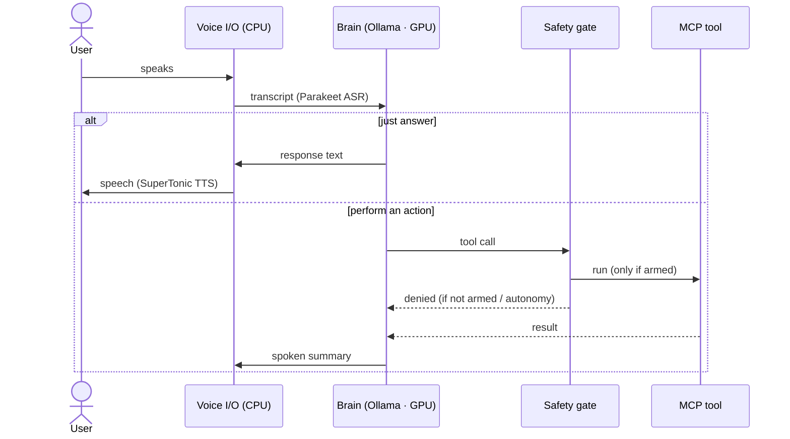
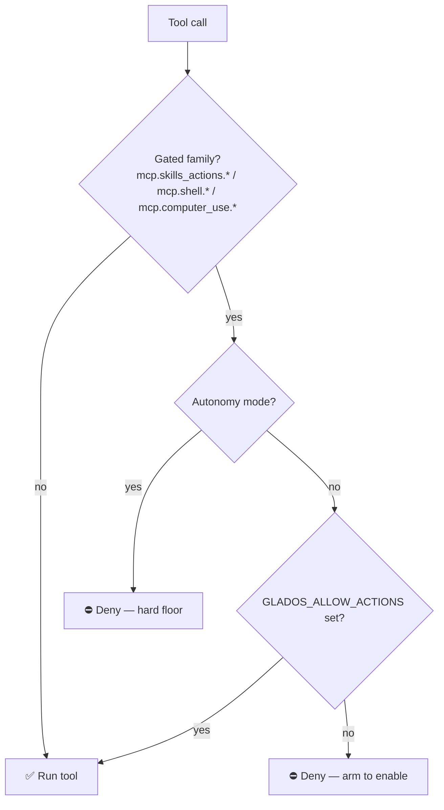

# AI Linux Assistant

A **local-first, Wayland-native voice assistant** for Linux that you can *talk to* — and that can *act* on
your machine (open apps, run commands, answer questions) through a confirmed, safety-gated tool layer.

Everything in the runtime path runs **locally and open-source**. No cloud, no API keys required.
Tuned to fit a **6 GB GPU** (RTX 3060 Mobile) by keeping the LLM on the GPU and speech on the CPU.

> Built by vendoring & evolving the excellent [dnhkng/GLaDOS](https://github.com/dnhkng/GLaDOS) engine.
> Design notes & decisions: [PLAN.md](PLAN.md).

---

## ✨ Features
- **Wake-word voice loop** with VAD (say "computer …"; **talk-over barge-in is on by default** via PipeWire echo-cancel — see [Barge-in](#-barge-in-interrupting-the-assistant)).
- **Voice *and* text** input (`input_mode: both`).
- **Local brain** — `qwen3:4b` via [Ollama](https://ollama.com) (GPU); switch to the lighter `qwen3:1.7b` via the Settings panel / `GLADOS_LLM_MODEL`.
- **CPU speech** — Parakeet ASR + SuperTonic TTS (Kokoro fallback), all ONNX, so the GPU stays free for the LLM.
- **Acts on your desktop** — **13 native typed tools** (`mcp.skills_actions.*`: brightness, volume, lock,
  screenshot, open app/link/folder, web/YouTube search, media, night light, do-not-disturb, settings,
  terminal, clipboard) the model calls directly, plus a general `shell` fallback. Reasoning is **on** so the
  small model reliably picks the right tool (verified 22/22 in a live test).
- **Safety gate** — irreversible actions (shell, desktop tools) are denied unless you explicitly arm them;
  a catastrophic-command denylist and kernel-enforced resource caps (`systemd-run`) back it up.
- **On-screen overlay** (GNOME Shell extension) — top-right orb + transcript that tracks state, with
  listening-mode controls (always / wake / click) that can hand the mic back to other apps, plus a
  **Settings window** (model, voice, listening, actions, barge-in) reachable from Extension Manager.

---

## 🧠 Architecture


The brain (LLM) is the only component on the GPU; ASR, VAD, and TTS run on the CPU as ONNX — that split
is what makes the assistant fit in 6 GB of VRAM.

### A conversational turn



---

## 🚀 Quick start

One script does everything — install and run:

```bash
./ai-linux setup     # one-time: conda env, deps, Ollama + qwen3:4b, ONNX weights, GNOME launcher + icon
./ai-linux           # voice + text  (auto-starts Ollama; on a fresh machine it self-runs setup first)
```

Then, day to day:

```bash
./ai-linux            # voice + text, local qwen3:4b brain      [default]
./ai-linux tui        # text-only Textual UI
./ai-linux doctor     # check everything is ready
./ai-linux download   # (re)fetch the ONNX speech weights
./ai-linux say "hi"   # speak a phrase and exit
./ai-linux uninstall  # revert everything setup changed (--dry-run to preview; --purge to also drop env/models/weights)
# flags: --groq (cloud brain)   --local (default)   --no-actions (don't arm shell/desktop actions)
#        --half-duplex (turn off voice barge-in)   --overlay-mode=always|wake|click
./ai-linux --version  # print the repo version (also shown in the overlay menu header + prefs)
```

Or click **AI Linux Assistant** in the GNOME app grid (installed by `setup`, with a custom glass-orb icon).
`setup` is idempotent — safe to re-run, and it records every system change to
`~/.local/state/ai-linux/install-manifest.tsv` so `./ai-linux uninstall` cleanly reverts exactly those changes.
Speech weights download on first `setup` only if not already present.

---

## 🔧 Configuration

All settings live in [`configs/ai_linux_config.yaml`](configs/ai_linux_config.yaml) (top key `Glados:`):

| Setting | What it does |
|---|---|
| `llm_model` / `completion_url` | brain model + endpoint (default local Ollama `qwen3:4b`) |
| `voice` | TTS voice: `supertonic:M1` (default; male `M1`/`M3`–`M5`, female `F1`–`F5`) or a Kokoro voice e.g. `am_michael` |
| `asr_engine` | `ctc` (faster) or `tdt` (more accurate) — both CPU |
| `input_mode` | `audio`, `text`, or `both` |
| `interruptible` | barge-in (interrupt the assistant by speaking) |
| `wake_word` | a trigger phrase, or `null` for always-listening |
| `personality_preprompt` | system prompt / persona |
| `mcp_servers` | the tools the assistant can call |

### Local or Groq brain

Two interchangeable brains — **speech, tools, and the safety gate are identical; only the LLM differs**:

| Brain | Config | Run | Notes |
|---|---|---|---|
| **Local** (default) | `configs/ai_linux_config.yaml` | `./ai-linux` | `qwen3:4b` via Ollama (GPU); lighter `qwen3:1.7b` via Settings / `GLADOS_LLM_MODEL` |
| **Groq API** | `configs/ai_linux_groq.yaml` | `export GROQ_API_KEY=… && ./ai-linux --groq` | faster/stronger cloud model; key read from env, never stored |

Any other OpenAI-compatible endpoint works too — point `completion_url`/`api_key` at it. **Local stays the
default focus.**

---

## 🛠 Tools (MCP servers)

Tools are exposed to the model as `mcp.<server>.<tool>`. The menu is deliberately **lean** — a short, stable
set of typed tools is what makes a small model reliably pick the right one (verified). **5 servers are active:**

| Server | Tools | Purpose | Gated |
|---|---|---|:---:|
| `system_info` | `system_overview`, `battery_status`, `network_status` | read-only system/battery/network status | — |
| `time_info` | `now_iso` | current time | — |
| **`skills_actions`** | `set_screen_brightness`, `set_volume`, `lock_screen`, `take_screenshot`, `open_app_or_link`, `search_web`, `control_media`, `toggle_night_light`, `set_do_not_disturb`, `open_settings`, `open_terminal`, `open_file_manager`, `clipboard` | the **13 typed desktop actions** — the model's main capability surface | ✅ |
| **`shell`** | `run_command` | general local command fallback (as you, never sudo) | ✅ |
| `voice` | `set_voice` | change the assistant's own TTS voice live | — |

Each `skills_actions` tool builds its exact command and runs it through the **same** gated + denylisted
executor as `shell` (`mcp/shell_exec.py::run_shell`), so nothing bypasses the safety layer. Built-in (non-MCP)
tools add `go_to_sleep` (ends the wake session — never the OS). Four more servers ship but are **disabled by
default** to keep the menu small (uncomment in the config to enable): `memory`, `skills` (keyword/hybrid
retrieval over `skills/`), `skills_writer` (`/learn` drafts), and `computer_use` (Wayland click/type GUI
automation — its window-control service is vendored into the overlay extension, dormant until enabled).

### Safety gate

Gated tools (`skills_actions` + `shell` + `computer_use`) are **off by default** and fail safe:



Interactive launches (`./ai-linux`, the GNOME app icon, `./ai-linux tui`) **arm actions by default** so the
assistant can actually act — mute the device, open apps, run commands. Disable with `./ai-linux --no-actions`.
The autonomous loop can **never** run gated actions, regardless of settings (hard floor).

### No superuser

The **running assistant never uses `sudo`/root** — every command runs as your user (verified: there is no
`sudo` call anywhere in the runtime). The **only** place sudo is used is `./ai-linux setup`, which does a
one-time `apt` install of a few user-level desktop tools (`brightnessctl`, `playerctl`, `wl-clipboard`,
`ydotool`) so brightness / media / clipboard / input work — skipped automatically if they're already present.
(Screenshots go through `computer-use-linux`'s sanctioned screen-capture portal; `gnome-screenshot` is **not**
installed — it adds a stray app-grid icon and is broken on GNOME Wayland.) Setup also scopes `ydotool`'s input
access via a **udev rule** (per-session ACL on `/dev/uinput`), not the broad `input` group, so nothing gains
system-wide keystroke read. Every system change setup makes is recorded so **`./ai-linux uninstall`** reverts
exactly those deltas — installs are fully and transparently reversible.

A destructive-command **denylist** (`mcp/shell_exec.py::_destructive_reason`, the single execution chokepoint
shared by every gated tool) refuses clearly catastrophic commands (`rm -rf ~`/`$HOME`/globs, `dd of=/dev/…`,
`mkfs`, `find <root> -delete`, fork bomb, `curl … | sh`, …) regardless of how they were produced. Commands
also run inside a `systemd-run --user --scope` with `TasksMax`/`MemoryMax` caps (kernel-enforced containment
of fork bombs / runaway memory; graceful fallback when unavailable). See **[SECURITY.md](SECURITY.md)** for
the full threat model, guarantees, and how to run disarmed (`./ai-linux --no-actions`).

---

## 🗣 Barge-in (interrupting the assistant)

**On by default:** `./ai-linux` runs **full-duplex** so you can talk over the assistant on open speakers —
your voice cuts it off mid-sentence (TTS is cancelled the instant VAD fires). It works because the launcher
routes audio through **PipeWire's WebRTC echo-cancel** (`module-echo-cancel`): capture goes through `pw-record`
and TTS plays through `pw-play` to an echo-cancelled sink, so the open mic never transcribes the assistant's
own voice. No system packages and **no `sudo`** — the AEC module is loaded as your user for the session and
unloaded on exit (fully reversible).

Why a separate PipeWire backend (`audio_io/pipewire_io.py`) instead of the in-process path: conda's PortAudio
only enumerates raw `hw:` ALSA cards and can't open PipeWire's `pipewire`/`pulse` PCMs, so it can't be routed
through `module-echo-cancel` directly. The PipeWire backend sidesteps that.

`./ai-linux --half-duplex` turns barge-in **off** — the mic is ignored while the assistant speaks (the echo
guard) and re-opens after a short hangover. Use it if AEC misbehaves on your hardware, or just use headphones
(a headset gives clean input with no echo to cancel).

---

## 🪟 On-screen overlay (optional)

A GNOME Shell extension shows a top-right **orb + transcript** that tracks the assistant's state
(idle / listening / thinking / speaking), with a mode header:

| Mode | Behavior | Sound card |
|---|---|---|
| **Always** | continuous listening | held by the assistant |
| **Wake** | acts only on a keyword (default "computer") | held (to hear the keyword) |
| **Click** | click the orb to talk one turn | **released between turns → other apps can use it** |
| **Mute** | instant pause | **released** |

`./ai-linux setup` installs and enables it; **log out and back in once** so GNOME loads it (Wayland only
loads new extensions at login). The orb is drawn natively by the Shell (not the browser Rive demo). Run
without it via `./ai-linux --no-overlay`, or pick the starting mode with `--overlay-mode=click`.

**Settings** live in two places sharing one store (`~/.config/ai-linux/settings.json`): the top-bar menu holds
the quick live controls (Voice, Listening), and **Extension Manager → Settings** (a full preferences window)
adds Model, Deep-thinking, Allow-actions, Barge-in, and Window-control. A change in one reflects in the other
instantly. The menu header shows the running build (**"AI Linux v2.4.0 — …"**); `./ai-linux doctor` warns if
the installed copy differs from the repo (Wayland loads extension code only at login, so re-copy + re-login
after edits).

## 📁 Project layout

```
ai-linux                       # single launcher + installer (setup · doctor · run · --version)
VERSION                        # repo version (MAJOR.MINOR.PATCH), kept in sync with the extension
configs/ai_linux_config.yaml   # active config  (+ ai_linux_groq.yaml for the Groq brain)
skills/                        # SKILL-*.md reference library (docs-only since the native-tools pivot)
ui/gnome-extension/…/          # overlay: extension.js + settingsLib.js (shared core) + prefs.js + windowControl.js
src/glados/                    # vendored GLaDOS engine (core/ mcp/ overlay/ tools/ ASR/ TTS/ audio_io/ …)
models/                        # model configs + ONNX speech weights (weights gitignored)
data/                          # ASR warm-up sample + demo assets
PLAN.md                        # design notes & decisions
```

---

## 📌 Status
**v2.4.0.** v1 plus the native-tools pivot (skills are typed function-calling tools, reasoning on), a
shared-core Settings/preferences system with versioning, kernel-enforced shell resource caps, and the
window-control service merged into the single overlay extension. Verified: configs load; safety gate + the
autonomy hard-floor; catastrophic denylist (42 blocked / 19 benign); and a **live tool-calling test against
`qwen3:4b` — 22/22**, the model both describing its abilities correctly and picking the right tool every time.
Runtime is fully provisioned locally (Ollama + `qwen3:4b`, all ONNX weights). Remaining user steps: the first
live **voice run** (mic + GPU) and **one logout/login** to load the extension. See [PLAN.md](PLAN.md) for the
roadmap (delegated executor, richer memory/RAG, per-action voice confirmation).

## 🙏 Credits & licenses
- Engine: **[dnhkng/GLaDOS](https://github.com/dnhkng/GLaDOS)** (MIT) — vendored; see [`LICENSE.GLaDOS`](LICENSE.GLaDOS).
- Desktop control: **[agent-sh/computer-use-linux](https://github.com/agent-sh/computer-use-linux)** (MIT).
- Default TTS: **[supertone-inc/supertonic](https://github.com/supertone-inc/supertonic)** (code MIT; weights OpenRAIL-M) — ONNX, fetched once on first use.
- Speech: Parakeet (ASR), SuperTonic + Kokoro (TTS), Silero (VAD). Brain: Ollama + `qwen3:4b` / `qwen3:1.7b` (local) or [Groq](https://groq.com) (API).
- Window-control D-Bus service vendored (MIT) from **[computer-use-linux](https://github.com/avifenesh/computer-use-linux)**; see [`LICENSE.computer-use-linux`](LICENSE.computer-use-linux).
- Pattern references: Newelle, RealtimeVoiceChat, Fabric, AIChat.

Vendored components retain their original licenses.
